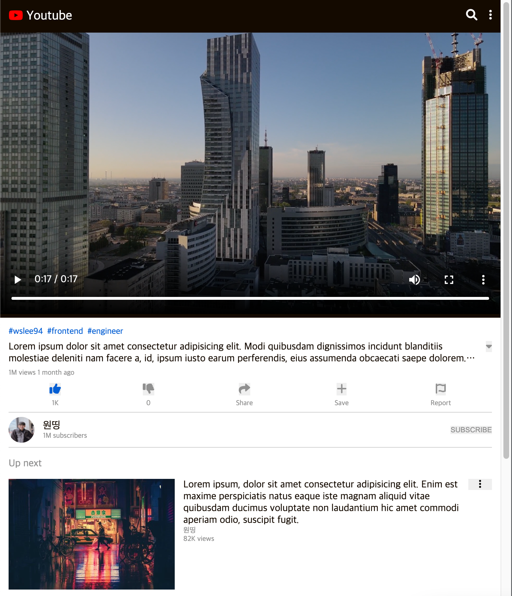

# <b>youtube-clone Repository</b>

## <b> 🗂️ Contents </b>

- ### <b> <a href="#0">🔗 Service introduce </a> </b>
- ### <b> <a href="#1">🔗 Pages </a> </b>

 
<h2 id="0">
  <b>✋ Service introduce</b>
</h2>
<b>youtube clone coding, 반응형 웹 및 스타일 공부</b> 

 
<h2 id="1">
  <b>📸 Pages</b>
</h2>

